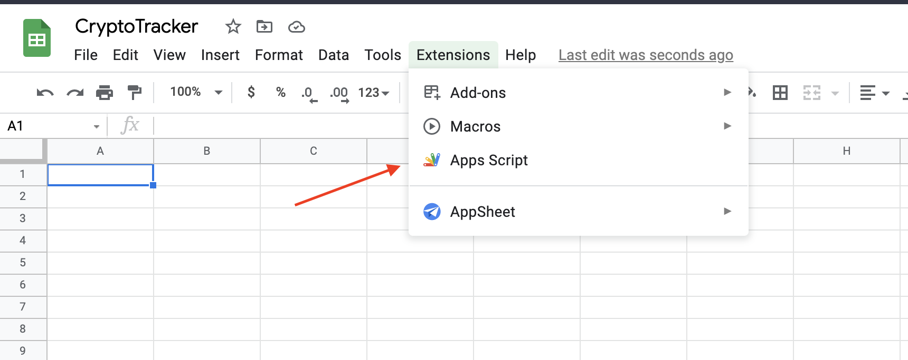
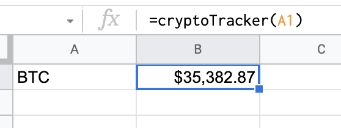

# CryptoTracker for Google SpreadSheet

CryptoTracker is a Google Sheets add-on that lets you create your own personalized crypto analyis. Combining Google Sheets and near real time crypto data.

## Installation steps

1. Open or create a new Google sheet.  
2. Go to **Extensions › App Script**

3. Rename the script **cryptoTracker** (or something similar)  
4. Copy the content of [cryptoTracker.js](cryptoTracker.js) and paste it in the script editor (replacing any existing content).  
5. Save the script by clicking the **Save icon**

## Using

1. Call the function `cryptoTracker.js` passing a valid token symbol

